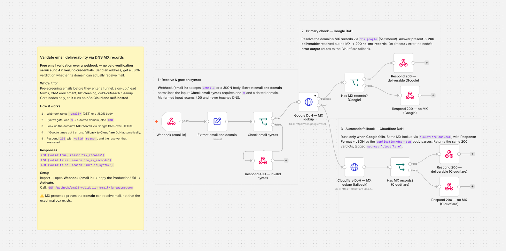

# n8n.io submission package — Email validation via DNS/MX

Everything needed to submit this template to the [n8n template library](https://n8n.io/workflows/),
prepared against the [official submission guidelines](https://n8n.notion.site/Template-submission-guidelines-9959894476734da3b402c90b124b1f77).

| File | Where it goes in the submission form |
|------|--------------------------------------|
| [`workflow.json`](workflow.json) | Import into n8n, then use **Share → Publish as template** (or paste the JSON). Contains the mandatory sticky notes. |
| [`article.md`](article.md) | The **Description** field (Markdown, no HTML). |
| [`preview.png`](preview.png) | Canvas screenshot of the finished workflow (sticky notes + layout). Optional here — it's not a community node, so n8n renders its own preview — but handy for the repo and any write-up. |

## Field values

- **Title:** `Validate email deliverability via DNS MX records over a webhook`
  (n8n title format: *action verb + thing + via/over + where*; objective, no emojis.)
- **Suggested categories:** Marketing, Sales _(pick one primary)_ — it's a lead/contact pre-screen.
- **Suggested tags:** `webhook`, `email`, `email validation`, `DNS`, `MX`, `data cleaning`, `lead qualification`.
- **Community node?** No — core nodes only, so **no self-hosted disclaimer and no workflow image are required**, and it runs on n8n Cloud.

## The hook

Free email validation with **no paid verification service and no credentials** — it resolves the
domain's MX records over public DNS-over-HTTPS (Google primary, automatic Cloudflare fallback).
This is the differentiator vs. ZeroBounce / NeverBounce-style paid API templates, and it's stated
up front in both the description and the yellow sticky note.

## Guidelines checklist

- [x] **Sticky notes (mandatory).** One yellow note carrying the full description + setup, three
      neutral (color 7) notes outlining the steps.
- [x] **No hardcoded API keys / credentials.** There are none — the workflow calls public DoH
      endpoints; no node has a `credentials` object.
- [x] **No personal identifiers.** No real emails, sheet IDs, or channels; the only sample is
      `jane@acme.com`.
- [x] **Descriptive node names.** Every node names its purpose (e.g. *Google DoH — MX lookup*,
      *Has MX records? (Cloudflare)*, *Respond 400 — invalid syntax*).
- [x] **Title format & tone.** Objective, no emojis, action-verb first.
- [x] **Description ~200 words, Markdown, no HTML**, using the suggested sections (Who's it for /
      How it works / How to set up / Requirements / How to customize).
- [x] **Original, plug-and-play.** Import → copy webhook URL → activate. No configuration required.
- [ ] **Optional:** record a short Loom of the setup (encouraged, not required).

## Verified

The underlying logic is the live-verified workflow in this template folder
([`../email-validation-dns.n8n-workflow.json`](../email-validation-dns.n8n-workflow.json)): all four
cases (deliverable, no-MX, invalid syntax, Cloudflare fallback) returned the expected status + JSON
end-to-end. This submission copy only adds sticky notes and clearer node names — the logic is
byte-for-byte the same behaviour.
